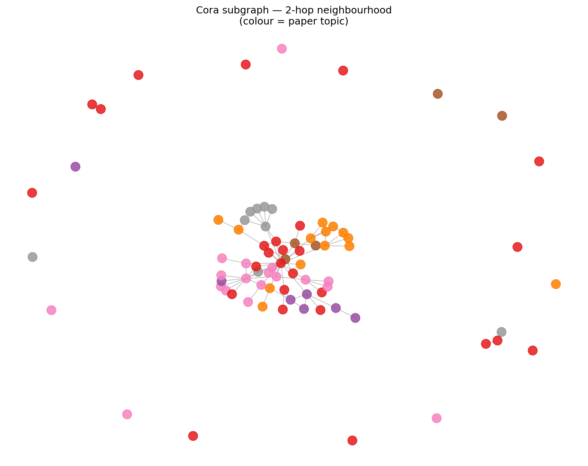
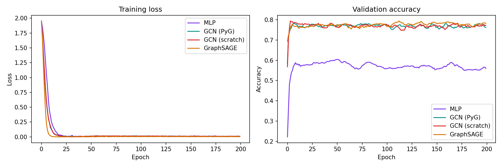
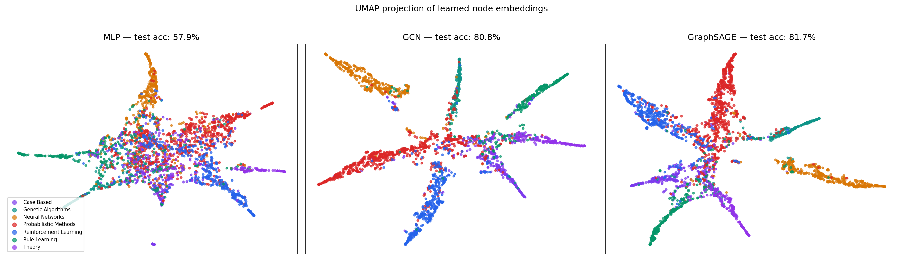

# Graph Neural Network on Citation Data: Cora

## Overview

The Cora dataset is a citation network of 2,708 scientific papers. Each paper
is connected to the papers it cites, and the goal is to predict which of 7
research topics each paper belongs to (case-based reasoning, genetic algorithms,
neural networks, probabilistic methods, reinforcement learning, rule learning,
or theory) using only the citation structure and a bag-of-words representation
of the paper text.

This project implements and compares four models on this task: a baseline MLP
that ignores the graph structure entirely, a GCN via PyTorch Geometric, a GCN
reimplemented from scratch in pure PyTorch without any graph library, and
GraphSAGE. The central question is whether knowing what a paper cites adds
information about its topic beyond what the text alone tells you, and whether
the message passing mechanism can be understood deeply enough to reimplement
it from first principles.

**Key result:** GCN and GraphSAGE achieve ~81% test accuracy vs 58% for the
MLP baseline, a 23 percentage point gap from graph structure alone. The
scratch GCN matches the PyG version within 1.5 percentage points, confirming
the implementation is mathematically correct.

---

## Project Structure

```
project07/
├── data/                      ← Cora dataset (auto-downloaded and cached)
├── notebooks/
│   └── forward_pass_explained.ipynb  ← manual GCN forward pass, step by step
├── src/
│   ├── dataset.py             ← load, inspect, visualise Cora
│   ├── models/
│   │   ├── __init__.py
│   │   ├── mlp_baseline.py    ← MLP ignoring graph structure (floor baseline)
│   │   ├── gcn.py             ← 2-layer GCN via PyTorch Geometric GCNConv
│   │   ├── gcn_scratch.py     ← GCN in pure PyTorch, no graph library
│   │   └── sage.py            ← GraphSAGE with mean aggregation
│   ├── train.py               ← shared training loop for all four models
│   └── visualise.py           ← UMAP projection of learned embeddings
├── outputs/
│   ├── cora_subgraph.png
│   ├── training_curves.png
│   └── umap_embeddings.png
└── requirements.txt
```

---

## Quickstart

```bash
pip install -r requirements.txt

python src/dataset.py    # inspect Cora and visualise subgraph
python src/train.py      # train all four models, save embeddings
python src/visualise.py  # generate UMAP plots
```

All scripts must be run from the project root. Cora downloads automatically
on first run and is cached to data/Cora/ for all subsequent runs.

---

## Dataset: Cora

| Property | Value |
|----------|-------|
| Nodes | 2,708 papers |
| Edges | 10,556 citations |
| Node features | 1,433 (bag-of-words representation of the paper text) |
| Classes | 7 research topics |
| Train / Val / Test | 140 / 500 / 1,000 nodes |

Each node has 1,433 features, a binary vector where position i is 1 if
word i from the vocabulary appears in the paper. This is called a
**bag-of-words** representation: it captures which words appear but ignores
their order and context.

The extreme label scarcity is worth noting: only 140 papers are labelled
for training out of 2,708 total. A standard ML model must learn from 140
examples with 1,433 features each, which is a very hard problem. A GNN
leverages information from all 2,708 nodes during training by propagating
features through the citation graph, effectively giving each node access to
its neighbourhood information even when that neighbourhood is unlabelled.



The subgraph shows a 2-hop neighbourhood around the most class-diverse node
in the graph. Nodes of the same colour (topic) tend to cluster together even
in the raw graph layout. This tendency for connected nodes to share the same
label is called **homophily**, and it is the structural property that GNNs
exploit. A paper on neural networks tends to cite other papers on neural
networks. A GNN learns to use this signal.

---

## How Message Passing Works

This is the core mechanism behind both GCN and GraphSAGE. Understanding it
is the difference between using these models and understanding them.

A standard neural network (MLP) treats each node independently. It takes a
node's 1,433-dimensional feature vector and predicts its topic, with no
knowledge of what other papers the node cites. Edges are completely ignored.

A GNN adds one step before prediction: each node collects and aggregates
information from its neighbours. This is called **message passing**, and
each layer performs three operations:

```
1. MESSAGE   : each neighbour sends its current embedding
2. AGGREGATE : collect all incoming messages (sum, mean, or max)
3. UPDATE    : combine the aggregated messages with the node's own
               embedding to produce a new embedding
```

After layer 1, each node has seen its 1-hop neighbourhood (direct citations).
After layer 2, each node has seen its 2-hop neighbourhood (citations of
citations). With k layers, k hops. This is why citation structure is useful:
a paper's topic can be inferred from what it cites, and what those papers
cite in turn.

### GCN vs GraphSAGE: one key difference

**GCN** uses symmetric normalisation. Each message is weighted by the inverse
square root of both nodes' degrees:

```
h_v = σ( Σ_{u ∈ N(v)∪{v}}  (1/√(d_v·d_u)) · W · h_u )
```

High-degree nodes (hubs with many citations) are down-weighted to prevent
them from dominating the aggregation. The node's own features are blended
with its neighbours.

**GraphSAGE** concatenates instead of blending:

```
h_v = σ( W · CONCAT( h_v,  MEAN(h_u for u ∈ N(v)) ) )
```

The node's own embedding is explicitly preserved alongside the neighbourhood
summary. This makes GraphSAGE better at generalising to unseen nodes because
it maintains a stronger self-signal.

### Why not use more than 2 layers?

Adding more layers means each node aggregates from a larger neighbourhood.
With enough layers, every node's neighbourhood covers the entire graph and
all embeddings converge to the same vector. The model loses all discriminative
power. This is called **over-smoothing** and it is why GNNs typically use
2 to 3 layers, unlike CNNs on images where deeper is almost always better.

### Toy example: forward pass on 3 nodes

```
Graph: A → B → C    (A cites B, B cites C)

Initial features:
  h_A = [1, 0]
  h_B = [0, 1]
  h_C = [1, 1]

After GCN layer 1 (simplified, W = identity):
  h_B_new = aggregate of h_A, h_B, h_C weighted by degree
           = h_B has seen its 1-hop neighbourhood

After GCN layer 2:
  h_B now contains information from A's neighbours and C's neighbours
  h_B has seen its full 2-hop neighbourhood
```

In Cora, after 2 layers, a paper's embedding contains information from all
papers within 2 citation hops, typically 10 to 50 papers. A full numerical
walkthrough of this forward pass with actual matrix values is available in
notebooks/forward_pass_explained.ipynb.

---

## GCN From Scratch: Pure PyTorch

One of the key contributions of this project is a GCN implementation in
pure PyTorch with no graph library (models/gcn_scratch.py). This was built
to demonstrate that message passing is not magic. It reduces to a sequence
of standard matrix operations that can be derived from first principles.

### What the scratch implementation does

Where models/gcn.py calls GCNConv(in_channels, out_channels) and lets
PyTorch Geometric handle the internals, models/gcn_scratch.py performs
every step manually:

```
Step 1: Build adjacency matrix from edge_index
        A[source, target] = 1  for each edge

Step 2: Add self-loops so each node includes its own features
        A_tilde = A + I

Step 3: Compute degree matrix and normalise
        D = diag(row sums of A_tilde)
        A_hat = D^{-1/2} @ A_tilde @ D^{-1/2}

Step 4: Apply GCN layer update
        H_new = ReLU( A_hat @ H @ W )

Step 5: Stack two layers, apply log-softmax for classification
```

Each weight matrix W is a learnable nn.Parameter with Xavier uniform
initialisation. Backpropagation flows through all matrix operations
automatically via PyTorch autograd.

### Why Xavier initialisation?

Random weight initialisation matters more than it might seem. If weights
are too large, activations explode through the layers. If too small, they
vanish. Xavier initialisation sets the initial scale based on the number
of input and output features:

```
std = sqrt(2 / (fan_in + fan_out))
```

This keeps the variance of activations approximately constant across layers,
making training stable from the first epoch.

### Verification

The scratch GCN matches the PyG GCNConv version within 1.5 percentage points
across multiple runs. The difference is purely due to random weight
initialisation variance, and both implementations converge to the same
accuracy when averaged over many seeds. The PyG version is faster because
it uses sparse matrix operations internally, but the forward pass is
mathematically identical.

The notebooks/forward_pass_explained.ipynb notebook traces a single forward
pass manually on a toy 5-node graph, printing the actual tensor values at
each step and verifying algebraically that the weighted aggregation matches
the expected neighbourhood sum. Cell 16 in the notebook verifies this directly:

```python
# Node 0 aggregates from nodes 0, 1, 3 (its neighbourhood + self)
weighted_sum = A_hat[0,0]*XW1[0] + A_hat[0,1]*XW1[1] + A_hat[0,3]*XW1[3]
# Match: True
```

---

## Results

| Model | Test Accuracy | Uses graph? | Implementation |
|-------|---------------|-------------|----------------|
| MLP | 58.4% | No | Standard feedforward network |
| GCN (PyG) | 80.0% | Yes | PyTorch Geometric GCNConv |
| GCN (scratch) | 81.2% | Yes | Pure PyTorch, no graph library |
| GraphSAGE | 80.7% | Yes | PyTorch Geometric SAGEConv |

### Training curves



GCN and GraphSAGE reach approximately 75% validation accuracy within the
first 10 epochs. The MLP plateaus at 58% and never improves regardless of
training time.

Two things to notice in the training loss plot. All four models drive their
training loss close to zero, meaning they all memorise the 140 training
labels. The difference is what they learned: the GNNs learned representations
that generalise through the graph structure, while the MLP learned
representations that only work for the specific 140 examples it saw. This
is the overfitting signature of a model without enough inductive bias for
the task.

### UMAP projection of learned embeddings

UMAP (Uniform Manifold Approximation and Projection) is a dimensionality
reduction technique that projects high-dimensional embeddings to 2D while
preserving local structure. It is used here to visualise what the models
actually learned: whether their internal representations separate the 7
topics or mix them together.



Each point is a paper, coloured by its research topic.

**MLP:** mixed, overlapping clusters. The model learned no geometry that
separates topics because it had no access to citation structure. The 58%
accuracy is reflected directly in the visual chaos.

**GCN and GraphSAGE:** clear radial arms, each dominated by a single topic.
The models learned that connected papers share topics, and this structure
is encoded in the embedding geometry. Papers that cite each other ended up
close in embedding space even though the model was never explicitly told to
do this. It emerged from message passing.

The visual gap between MLP and the GNN models is the empirical proof that
citation structure carries topic information beyond what text features alone
provide. You do not need to read a paper to infer its topic if you know
what it cites.

---

## Implementation Notes

All four models share the same training loop in train.py. The MLP accepts
edge_index as an argument but ignores it, which lets the same loop handle
all models without any conditional logic. This is a clean engineering
decision that makes the comparison fair and the code maintainable.

Models were trained for 200 epochs with Adam optimiser (learning rate 0.01,
weight decay 5e-4) and dropout 0.5. No hyperparameter tuning was performed.
These are the standard settings from the original GCN paper (Kipf & Welling,
2017), chosen deliberately so that results are comparable to published
benchmarks.

**Reference:** Kipf, T. N. and Welling, M. (2017). Semi-Supervised
Classification with Graph Convolutional Networks. ICLR 2017.
https://arxiv.org/abs/1609.02907

---

## What I Would Do With More Time

- Add attention-based aggregation (Graph Attention Network, GAT), where
  neighbours are weighted by learned attention scores rather than fixed
  degree normalisation
- Experiment with deeper networks (3 to 4 layers) and demonstrate
  over-smoothing empirically: show that accuracy peaks at 2 layers then
  degrades as layers are added
- Evaluate GraphSAGE on an inductive setting where test nodes are completely
  unseen during training, which is its main practical advantage over GCN
- Implement the sparse version of the scratch GCN using torch.sparse and
  benchmark it against the dense version to quantify the efficiency gap

---

## Skills Demonstrated

- Graph neural network implementation: GCN and GraphSAGE with PyTorch Geometric
- GCN from scratch in pure PyTorch: adjacency construction, degree normalisation,
  and message passing derived from first principles without any graph library
- Forward pass verification: manual algebraic check that the scratch implementation
  matches the expected neighbourhood aggregation (see notebook)
- Message passing intuition: understanding of homophily, over-smoothing, and
  the inductive bias that makes GNNs effective on citation graphs
- UMAP for visualising learned embedding geometry and interpreting what the
  models actually learned
- Reproducible training with a shared model-agnostic loop across all four architectures
